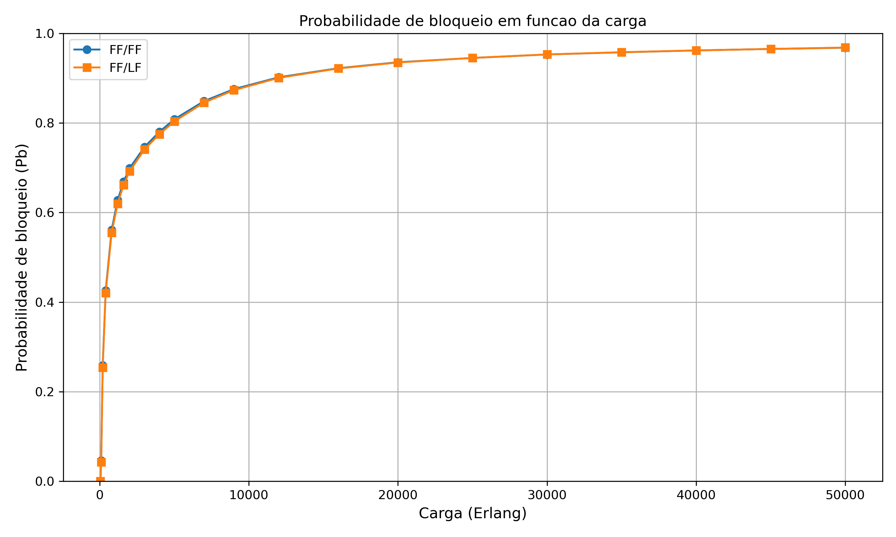

# Avaliação de Políticas de Alocação Espectral em Redes Ópticas Elásticas

Este repositório contém o simulador desenvolvido para o Trabalho de Conclusão de Curso intitulado **"Avaliação de Políticas de Alocação Espectral em Redes Ópticas Elásticas com Tráfego Multiclasse"**.

O objetivo do simulador é comparar políticas de alocação espectral em Redes Ópticas Elásticas (*Elastic Optical Networks - EONs*), considerando tráfego dinâmico multiclasse e restrições de contiguidade, continuidade e não sobreposição de slots.

## Sobre o projeto

As Redes Ópticas Elásticas permitem a alocação flexível do espectro óptico em blocos de slots, ajustados à demanda de cada conexão. Entretanto, essa flexibilidade introduz desafios relacionados ao roteamento, à alocação de espectro, à fragmentação espectral e ao desalinhamento dos blocos disponíveis ao longo das rotas.

Neste projeto, foi desenvolvido um simulador de eventos discretos em Python para avaliar o comportamento de uma EON sob diferentes composições de tráfego e intensidades de carga. O foco principal está na comparação entre duas combinações de políticas de alocação espectral:

- **FF/FF**: requisições small e large alocadas com First-Fit;
- **FF/LF**: requisições small alocadas com First-Fit e requisições large alocadas com Last-Fit.

## Políticas avaliadas

O simulador compara duas combinações de políticas:

- **FF/FF**: requisições small e large são alocadas com First-Fit;
- **FF/LF**: requisições small são alocadas com First-Fit e requisições large são alocadas com Last-Fit.

A política **First-Fit** seleciona o primeiro bloco contíguo disponível que atende à requisição. Já a política **Last-Fit** seleciona o último bloco contíguo disponível no espectro.

## Parâmetros principais

Os parâmetros utilizados estão alinhados aos experimentos finais apresentados na monografia:

- topologia com 12 nós;
- 28 enlaces direcionais;
- 132 pares origem-destino ordenados;
- 320 slots por enlace;
- 1.000.000 de requisições por simulação;
- cargas entre 50 e 50000 Erlang;
- tráfego dinâmico com chegadas e tempos de permanência exponenciais;
- classe small com 3 ou 5 slots, conforme a rota;
- classe large com 8 ou 10 slots, conforme a rota;
- roteamento por menor caminho fixo;
- seleção uniforme dos pares origem-destino.

## Métricas calculadas

O simulador calcula:

- probabilidade de bloqueio total;
- quantidade de requisições aceitas e bloqueadas;
- posição média das requisições large aceitas;
- distribuição das requisições large entre metade baixa e metade alta do espectro;
- classificação das causas de bloqueio em:
  - recurso bruto;
  - fragmentação local;
  - desalinhamento espectral.

## Saídas geradas

Ao final da execução, o simulador gera:

- arquivo de log com os resultados numéricos da simulação;
- gráfico da probabilidade de bloqueio em função da carga oferecida.

Os gráficos comparativos apresentados na monografia, como as análises de ganho da política FF/LF em relação à FF/FF e a diferença em função da probabilidade de bloqueio, foram gerados em uma etapa posterior de pós-processamento, a partir dos resultados consolidados das simulações.

## Exemplo de resultado

A imagem abaixo apresenta um exemplo de gráfico gerado pelo simulador, relacionando a probabilidade de bloqueio com a carga oferecida em Erlang.



## Estrutura do repositório

```text
avaliacao-politicas-eon/
│
├── results/
│   └── pb_vs_erlang.png
│
├── src/
│   └── eon_spectrum_allocation_simulator.py
│
├── .gitignore
├── LICENSE
├── README.md
└── requirements.txt
```

## Como executar

Para executar o simulador, é necessário ter o Python instalado na máquina.

Primeiro, clone este repositório:

```bash
git clone https://github.com/EduardoLacerda-try/avaliacao-politicas-eon.git
```

Em seguida, acesse a pasta do projeto:

```bash
cd avaliacao-politicas-eon
```

Instale as dependências necessárias:

```bash
pip install -r requirements.txt
```

Execute o simulador:

```bash
python src/eon_spectrum_allocation_simulator.py
```

Ao final da execução, o simulador gera um arquivo de log com os resultados numéricos e um gráfico da probabilidade de bloqueio em função da carga oferecida.

## Cenários de tráfego

O parâmetro `PROB_SMALL`, definido no arquivo do simulador, representa a probabilidade de uma requisição pertencer à classe small.

Para reproduzir os três cenários avaliados na monografia, altere esse parâmetro no código para:

```python
PROB_SMALL = 0.1
PROB_SMALL = 0.5
PROB_SMALL = 0.9
```

Esses valores representam, respectivamente:

- predominância de requisições large;
- cenário balanceado entre requisições small e large;
- predominância de requisições small.

## Limitações do modelo

Este simulador foi desenvolvido com finalidade acadêmica, como parte de um Trabalho de Conclusão de Curso em Engenharia de Controle e Automação.

O modelo utiliza algumas simplificações, como:

- roteamento por menor caminho fixo;
- escolha uniforme dos pares origem-destino;
- ausência de conversão espectral;
- aproximação da demanda espectral pelo número de saltos da rota;
- não modelagem explícita de parâmetros físicos como OSNR, formato de modulação e penalidades da camada óptica.

Essas simplificações permitiram manter o escopo do estudo controlado e concentrar a análise na comparação entre as políticas FF/FF e FF/LF.

## Tecnologias utilizadas

- Python
- NumPy
- NetworkX
- Matplotlib
- Simulação de eventos discretos
- Modelagem computacional
- Análise de desempenho

## Autor

**Eduardo da Silva Lacerda**  
Instituto Federal de Educação, Ciência e Tecnologia de São Paulo — Campus Guarulhos  
Bacharelado em Engenharia de Controle e Automação  

LinkedIn: [Eduardo da Silva Lacerda](https://www.linkedin.com/in/eduardo-da-silva-lacerda-b4b604296)

## Licença

Este projeto está licenciado sob a licença MIT. Consulte o arquivo `LICENSE` para mais informações.
